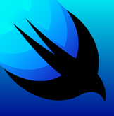
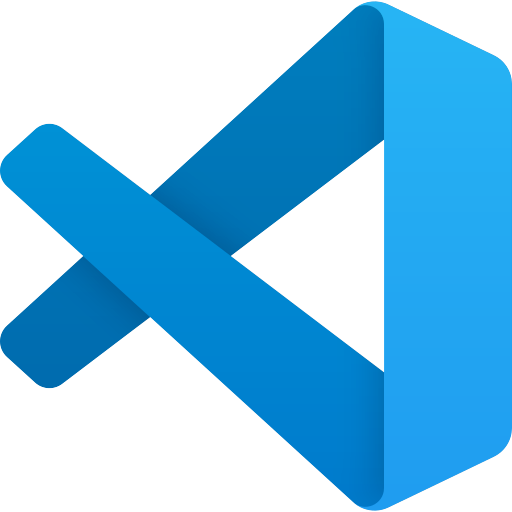
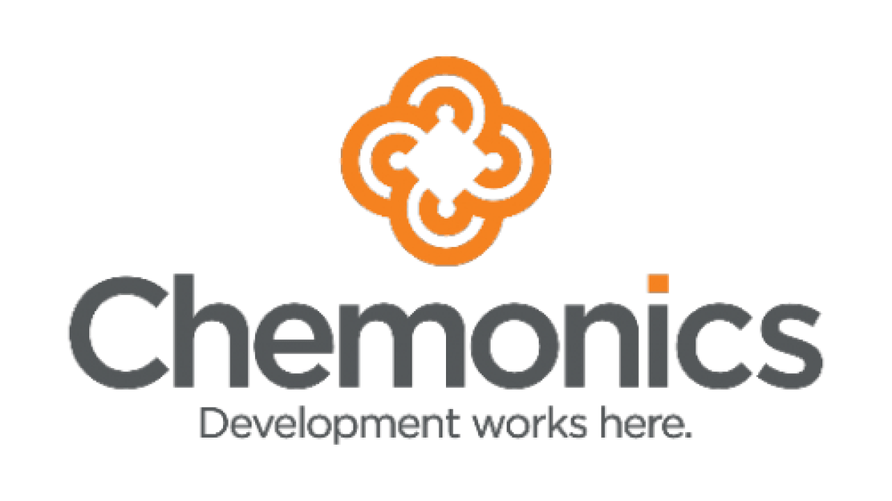
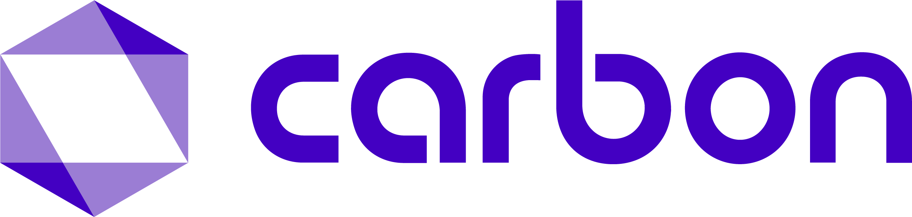
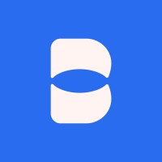
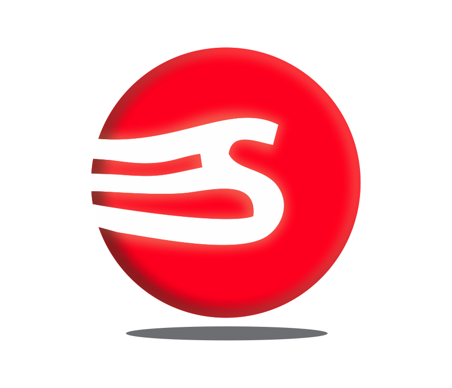
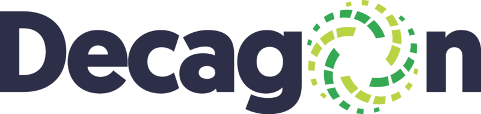
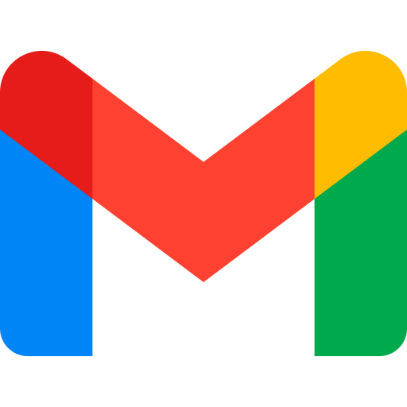

### Welcome, I'm Hassan 👋

#### 🚀 Software Engineer | Mobile Developer

I'm passionate about building impactful digital mobile applications, which I have demonstrated through a portfolio that spans automated downstream petroleum marketing, government revenue digital initiatives, fintech, and the global health supply chain. With experience in Android & iOS development, I specialize in crafting scalable, intuitive, aesthetically appealing, high-performance applications.

### 📚 Tech Stack

💻 Languages: 

📱 Frameworks:

🖥️ IDEs:

 

🛠 Tools & Platforms:

### 👨‍💻 Formerly @

<table>
 <tr>
    <td>
        
    </td>
    <td>
        
    </td>
    <td>
        
    </td>
    <td>
        
    </td>
    <td>
        
    </td>
</tr>
</table>

### 📫 Get in Touch

&nbsp;

Let's build something great together! 🚀

